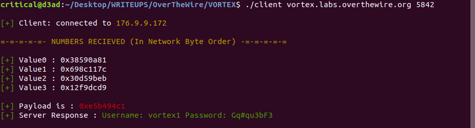

## VORTEX0
As the first challenge says -

**Note:** vortex is on an 32bit x86 machine (meaning, a little endian architecture)

Since I'm working on an intel processor (which is little endian in architecture) and the server is also x86 little endian in architecture, there is no need of to and fro conversion into byte ordering.

[Here] is the code written in C language using Unix socket API. This prooved out to be a refresher to my network programming concepts.

NAME  : **ABHINAV THAKUR**  
EMAIL : **compilepeace@gmail.com**

[Here]: ./client.c